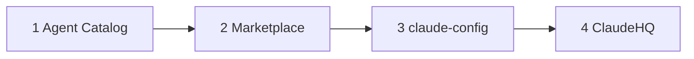

<div align="center">

# Claude Agent Catalog

### Full **AI agent inventory** for [**Claude Code**](https://claude.ai/claude-code)

[](https://github.com/SkyWalker2506/claude-config)
[](https://github.com/SkyWalker2506/claude-config/blob/main/config/agent-registry.json)
[](https://github.com/SkyWalker2506/claude-agent-catalog#categories)
[](https://github.com/SkyWalker2506/claude-config/blob/main/LICENSE)

**Cost-aware routing · Knowledge-first `AGENT.md` + `knowledge/` · Auto-dispatch with [claude-config](https://github.com/SkyWalker2506/claude-config)**

[Jump to agent table](#all-agents) · [Quick install](#quick-start) · [Ecosystem](#ecosystem-on-github-start-here)

</div>

---

Part of the [**claude-config**](https://github.com/SkyWalker2506/claude-config) **Multi-Agent OS** — orchestration, local-first model routing, hooks, and registry-backed dispatch.

## Ecosystem on GitHub (start here)

This repo is **step 1** on GitHub: **agents → plugins → full OS → workspace HQ**.



| Step | Repository | Role |
|------|------------|------|
| **1** | **claude-agent-catalog** (this repo) | Full agent inventory, categories, `/dispatch` examples |
| **2** | [claude-marketplace](https://github.com/SkyWalker2506/claude-marketplace) | Plugin catalog, one-line installs, native marketplace |
| **3** | [claude-config](https://github.com/SkyWalker2506/claude-config) | Multi-Agent OS — `install.sh`, MCP, skills, hooks, registry |
| **4** | [ClaudeHQ](https://github.com/SkyWalker2506/ClaudeHQ) | Ecosystem workspace — multi-project `claude` session |
| — | [sdk-market](https://github.com/SkyWalker2506/sdk-market) | Optional — SDKs and kits |

READMEs stay cross-linked; the live source of truth for counts is **`main`** on [claude-config](https://github.com/SkyWalker2506/claude-config).

## Quick Start

```bash
# Full system (agents + skills + MCP + hooks + auto-dispatch — see claude-config)
git clone https://github.com/SkyWalker2506/claude-config.git ~/Projects/claude-config
cd ~/Projects/claude-config && ./install.sh

# Only agents (add agent .md files to ~/.claude/agents/)
git clone https://github.com/SkyWalker2506/claude-agent-catalog.git
cd claude-agent-catalog && ./install.sh
```

## Auto-Dispatch

> **Requires the full [claude-config](https://github.com/SkyWalker2506/claude-config) install.** The standalone `install.sh` above only copies agent definition files — auto-dispatch, `/dispatch`, and `/agent-refine` are skills provided by `claude-config`.

Once the full system is installed, agents activate automatically based on your task:

```
/dispatch write a REST API         → B2 Backend Coder (Sonnet)
/dispatch security audit           → B13 Security Auditor (Opus)
/dispatch plan sprint              → I2 Sprint Planner (Sonnet)
/dispatch research competitors     → H1 Market Researcher (Sonnet)
```

Or in any Claude Code session — plans automatically route to the right agent.

## Categories

| Category | Agents | Active | Description |
|----------|--------|--------|-------------|
| `orchestrator` | 14 | 11 | Routing, dispatch, budget, fallback, lead agents |
| `backend` | 52 | 7 | API, code, mobile, Unity, web, security |
| `code-review` | 7 | 3 | Lint, security scan, AI review |
| `design` | 13 | 0 | UI/UX, Figma, brand, assets, Unity UI |
| `3d-cad` | 12 | 0 | Blender, CAD, render, Unity 3D/XR |
| `data-analytics` | 13 | 0 | ETL, SQL, visualization, reports, Unity analytics |
| `ai-ops` | 12 | 3 | MCP health, monitoring, coordination, Unity ML |
| `market-research` | 16 | 3 | Research, SEO, GEO, social, content |
| `jira-pm` | 10 | 3 | Sprint, status, decomposition |
| `devops` | 12 | 3 | Docker, cloud, deploy, incidents, Unity DevOps |
| `research` | 15 | 3 | Web research, docs, trends, datasets |
| `productivity` | 6 | 1 | Email, calendar, notes, files |
| `marketing-engine` | 4 | 0 | Landing pages, A/B, analytics |
| `prompt-engineering` | 5 | 0 | Prompt design, agent builder, workflow |
| `sales-bizdev` | 5 | 0 | Proposals, CRM, outreach |

## All Agents

🟢 = Active (auto-dispatched) | 🔵 = Pool (activate with `/agent-refine`)

### Orchestrator (A)

| Status | ID | Name | Model | Capabilities |
|--------|----|------|-------|--------------|
| 🟢 | A0 | Jarvis | opus | session-management, dispatch, routing |
| 🟢 | A1 | Lead Orchestrator | opus | strategy, vision, architecture |
| 🟢 | A2 | Task Router & Dispatcher | haiku | classification, routing, capability-matching |
| 🟢 | A3 | Fallback Manager | opus | model-switching, health-check |
| 🟢 | A4 | Token Budget Manager | opus | quota-tracking, mode-switching, cost-control |
| 🟢 | A5 | Context Pruner | opus | summarization, context-management, state-transfer |
| 🔵 | A6 | Daily Health Check | opus | monitoring, health-check |
| 🔵 | A7 | Weekly Analyst | opus | web-search, trend-analysis, reporting |
| 🔵 | A8 | Manual Control | opus | emergency-stop, human-handoff |
| 🟢 | A9 | ArtLead | opus | ui-ux, content, accessibility |
| 🟢 | A10 | CodeLead | opus | performance, data, architecture |
| 🟢 | A11 | GrowthLead | opus | seo, growth, analytics |
| 🟢 | A12 | BizLead | opus | monetization, competitive |
| 🟢 | A13 | SecLead | opus | security |

### Backend (B)

| Status | ID | Name | Model | Capabilities |
|--------|----|------|-------|--------------|
| 🟢 | B1 | Backend Architect | opus | architecture, api-design, database-design |
| 🟢 | B2 | Backend Coder | sonnet | api, crud, rest |
| 🟢 | B3 | Frontend Coder | sonnet | react, flutter, ui |
| 🔵 | B4 | API Integrator | sonnet | api-integration, oauth, webhook |
| 🟢 | B5 | Database Agent | sonnet | sql, nosql, migration |
| 🔵 | B6 | Test Writer | sonnet | unit-test, integration-test, e2e-test |
| 🟢 | B7 | Bug Hunter | sonnet | debugging, root-cause-analysis, error-tracing |
| 🔵 | B8 | Refactor Agent | sonnet | refactoring, dead-code, simplification |
| 🔵 | B9 | CI/CD Agent | sonnet | ci, cd, pipeline |
| 🔵 | B10 | Dependency Manager | sonnet | dependency-update, vulnerability-check, version-management |
| 🔵 | B11 | Git Manager | sonnet | branch, merge, conflict-resolution |
| 🔵 | B12 | Performance Optimizer | sonnet | profiling, bottleneck, caching |
| 🟢 | B13 | Security Auditor | sonnet | owasp, sql-injection, xss |
| 🔵 | B14 | Scripting Agent | sonnet | bash, python, automation |
| 🟢 | B15 | Mobile Dev Agent | sonnet | flutter, dart, mobile-ui |
| 🔵 | B16 | Web Game Dev Agent | sonnet | phaser, pixi, threejs |
| 🔵 | B17 | Full Stack Web Agent | sonnet | nextjs, react, nodejs |
| 🔵 | B18 | Python Specialist | sonnet | fastapi, django, flask |
| 🔵 | B19 | Unity Developer | sonnet | unity, csharp, ecs |
| 🔵 | B20 | API Gateway Agent | sonnet | api-gateway, rate-limiting, auth-middleware |
| 🔵 | B21 | WebSocket Agent | sonnet | websocket, socket-io, real-time |
| 🔵 | B22 | Unity Shader Developer | sonnet | shaderlab, hlsl, shader-graph |
| 🔵 | B23 | Unity Multiplayer | sonnet | netcode, mirror, photon |
| 🔵 | B24 | Unity AI & Navigation | sonnet | navmesh, behavior-tree, state-machine |
| 🔵 | B25 | Unity AR/XR Developer | sonnet | arfoundation, xr-interaction-toolkit, meta-quest |
| 🔵 | B26 | Unity Audio Engineer | sonnet | audio-mixer, fmod, wwise |
| 🔵 | B27 | Unity Physics Specialist | sonnet | physx, collision-layers, joints |
| 🔵 | B28 | Unity Save & Serialization | sonnet | save-system, json-serialization, binary-serialization |
| 🔵 | B29 | Unity Localization | sonnet | localization-package, rtl-support, font-management |
| 🔵 | B30 | Unity Editor Tooling | sonnet | custom-inspector, editor-window, property-drawer |
| 🔵 | B31 | Unity Procedural Generation | sonnet | wave-function-collapse, noise-algorithms, dungeon-generation |
| 🔵 | B32 | Unity Mobile Optimizer | sonnet | il2cpp, managed-stripping, thermal-throttling |
| 🔵 | B33 | Unity Console/Platform | sonnet | ps5, xbox, switch |
| 🔵 | B34 | Unity ECS/DOTS Specialist | sonnet | entities, systems, jobs |
| 🔵 | B35 | Unity 2D Specialist | sonnet | sprite-renderer, 2d-physics, tilemap-2d |
| 🔵 | B36 | Unity Input System | sonnet | new-input-system, action-maps, rebinding |
| 🔵 | B37 | Unity Camera Systems | sonnet | cinemachine-advanced, split-screen, picture-in-picture |
| 🔵 | B38 | Unity Memory Manager | sonnet | memory-profiler, gc-optimization, native-containers |
| 🔵 | B39 | Unity Testing Specialist | sonnet | playmode-test, editmode-test, performance-testing |
| 🔵 | B40 | Unity Cloud Services | sonnet | remote-config, cloud-save, economy |
| 🔵 | B41 | Unity Monetization | sonnet | iap, unity-ads, ad-mediation |
| 🔵 | B42 | Unity Security & Anti-Cheat | sonnet | code-obfuscation, memory-protection, server-validation |
| 🔵 | B43 | Unity Accessibility | sonnet | screen-reader, colorblind, input-accessibility |
| 🔵 | B44 | Unity Dialogue System | sonnet | dialogue-trees, branching-narrative, ink-integration |
| 🔵 | B45 | Unity Inventory & Crafting | sonnet | inventory-system, item-database, crafting-recipes |
| 🔵 | B46 | Unity Combat System | sonnet | hitbox-hurtbox, damage-calculation, combo-system |
| 🔵 | B47 | Unity Quest & Mission System | sonnet | quest-tracking, objectives, rewards |
| 🔵 | B48 | Unity Game Economy Designer | sonnet | virtual-currency, reward-loops, gacha-balance |
| 🔵 | B49 | Unity State Machine | sonnet | fsm, hfsm, pushdown-automata |
| 🔵 | B50 | Unity Dependency Injection | sonnet | zenject, vcontainer, service-locator |
| 🔵 | B51 | Unity Asset Workflow | sonnet | addressables-advanced, asset-bundles, asset-import-pipeline |
| 🔵 | B52 | Unity Streaming & Open World | sonnet | scene-streaming, additive-scenes, lod-streaming |

### Code Review (C)

| Status | ID | Name | Model | Capabilities |
|--------|----|------|-------|--------------|
| 🟢 | C1 | Lint & Format Hook | free-deterministic | lint, format, type-check |
| 🟢 | C2 | Security Scanner Hook | free-deterministic | secret-scan, dependency-audit, sast |
| 🟢 | C3 | Local AI Reviewer | haiku | code-review, correctness, security |
| 🔵 | C4 | Code Rabbit Agent | free-coderabbit | deep-review, coderabbit |
| 🔵 | C5 | CI Review Agent | free-github-action | pr-review, ci-review |
| 🔵 | C6 | Human Review Coordinator | haiku | review-routing, human-handoff |
| 🔵 | C7 | Unity Code Reviewer | sonnet | unity-csharp-review, monobehaviour-lifecycle, gc-allocation |

### Design (D)

| Status | ID | Name | Model | Capabilities |
|--------|----|------|-------|--------------|
| 🔵 | D1 | UI/UX Researcher | free-web | ui-research, competitor-ui, trend |
| 🔵 | D2 | Design System Agent | local-llama | color, typography, spacing |
| 🔵 | D3 | Stitch Coordinator | local-llama | stitch, design-to-code, tailwind |
| 🔵 | D4 | Figma Assistant | local-qwen-9b | figma, component-extraction, figma-api |
| 🔵 | D5 | Presentation Builder | local-qwen-9b | slides, powerpoint, keynote |
| 🔵 | D6 | Image Prompt Generator | free-router | midjourney, dalle, prompt-engineering |
| 🔵 | D7 | Icon & Asset Agent | free-router | svg, icon, asset-optimization |
| 🔵 | D8 | Mockup Reviewer | haiku | design-review, ux-audit, accessibility |
| 🔵 | D9 | Brand Identity Agent | haiku | brand-guide, logo-concept, color-palette |
| 🔵 | D10 | Motion Graphics Agent | haiku | animation-design, flutter-animation, page-transitions |
| 🔵 | D11 | Unity UI Developer | sonnet | ui-toolkit, ugui, uss |
| 🔵 | D12 | Unity UX Flow Designer | sonnet | menu-flow, hud-design, player-onboarding |
| 🔵 | D13 | Unity HUD & Minimap | sonnet | hud-system, minimap, compass |

### 3D-CAD (E)

| Status | ID | Name | Model | Capabilities |
|--------|----|------|-------|--------------|
| 🔵 | E1 | 3D Concept Planner | haiku | 3d-planning, reference, scene-composition |
| 🔵 | E2 | Blender Script Agent | local-qwen-9b | blender, python-scripting, geometry-nodes |
| 🔵 | E3 | CAD Automation | local-qwen-9b | autocad, scripting, parametric-design |
| 🔵 | E4 | Render Pipeline | free-script | render-queue, batch-render |
| 🔵 | E5 | 3D Asset Optimizer | local-qwen-9b | lod, polygon-reduction, texture-optimization |
| 🔵 | E6 | Unity VFX & Animation | sonnet | vfx-graph, particle-system, animator |
| 🔵 | E7 | Unity Technical Artist | sonnet | asset-pipeline, lod, texture-optimization |
| 🔵 | E8 | Unity Level Designer | sonnet | terrain, probuilder, tilemap |
| 🔵 | E9 | Unity Cinematic Director | sonnet | timeline-advanced, cinemachine-rigs, cutscene-pipeline |
| 🔵 | E10 | Unity Lighting Artist | sonnet | lightmapping, light-probes, reflection-probes |
| 🔵 | E11 | Unity Terrain Specialist | sonnet | terrain-tools, vegetation, speedtree |
| 🔵 | E12 | Unity Rigging & Skinning | sonnet | avatar-setup, humanoid-generic, animation-rigging |

### Data Analytics (F)

| Status | ID | Name | Model | Capabilities |
|--------|----|------|-------|--------------|
| 🔵 | F1 | Data Cleaner | local-qwen-9b | pandas, data-cleaning, normalization |
| 🔵 | F2 | Data Analyst | sonnet | statistics, insight, correlation |
| 🔵 | F3 | Visualization Agent | haiku | chart, graph, matplotlib |
| 🔵 | F4 | ETL Pipeline Agent | free-script | etl, pipeline, data-transfer |
| 🔵 | F5 | Report Generator | local-qwen-9b | pdf, markdown, report |
| 🔵 | F6 | SQL Agent | haiku | sql, query-optimization |
| 🔵 | F7 | Spreadsheet Agent | local-qwen-9b | excel, sheets, formulas |
| 🔵 | F8 | Jupyter Agent | local-qwen-9b | jupyter, notebook, analysis |
| 🔵 | F9 | Data Quality Agent | free-script | data-validation, consistency |
| 🔵 | F10 | Statistics Agent | local-qwen-9b | hypothesis-testing, regression, bayesian |
| 🔵 | F11 | Unity Analytics | sonnet | unity-analytics, custom-events, ab-testing |
| 🔵 | F12 | Unity Performance Profiler | sonnet | frame-analysis, deep-profiling, cpu-gpu-markers |
| 🔵 | F13 | Unity Playtesting Analyst | sonnet | playtest-data, heatmaps, player-behavior |

### AI-Ops (G)

| Status | ID | Name | Model | Capabilities |
|--------|----|------|-------|--------------|
| 🟢 | G1 | Agent Coordinator | sonnet | multi-agent, orchestration, parallel-dispatch |
| 🔵 | G2 | Model Monitor | free-cron | model-health, latency-check |
| 🟢 | G3 | MCP Health Agent | free-script | health-check, mcp-monitoring, connectivity-test |
| 🔵 | G4 | Config Manager | free-script | config-sync, settings-management |
| 🔵 | G5 | Log Analyzer | local-qwen-9b | log-analysis, pattern-detection |
| 🔵 | G6 | Backup Agent | free-script | backup, restore |
| 🟢 | G7 | Update Checker | free-web | version-check, update-detection, changelog-parse |
| 🔵 | G8 | Cron Scheduler | free-script | cron, scheduling, launchd |
| 🔵 | G9 | Performance Monitor | free-script | token-tracking, response-time |
| 🔵 | G10 | Deployment Agent | haiku | vercel, firebase-deploy, github-pages |
| 🔵 | G11 | Unity ML-Agents Trainer | sonnet | reinforcement-learning, imitation-learning, training-environments |
| 🔵 | G12 | Unity Sentis | sonnet | onnx-inference, on-device-ai, npc-behavior |

### Market Research (H)

| Status | ID | Name | Model | Capabilities |
|--------|----|------|-------|--------------|
| 🟢 | H1 | Market Researcher | sonnet | market-analysis, competitor-research, trend-analysis |
| 🔵 | H2 | Competitor Analyst | free-web | competitor, swot, benchmark |
| 🔵 | H3 | Revenue Analyst | sonnet | revenue-model, pricing, unit-economics |
| 🔵 | H4 | Pricing Strategist | haiku | pricing, ab-test, optimization |
| 🟢 | H5 | SEO Agent | free-script | seo-audit, keyword-research, meta-optimization |
| 🟢 | H6 | GEO Agent | haiku | geo-optimization, ai-visibility, llm-seo |
| 🔵 | H7 | Social Media Agent | local-qwen-9b | post-generation, linkedin, twitter |
| 🔵 | H8 | Content Repurposer | local-qwen-9b | content-splitting, repurpose, multi-channel |
| 🔵 | H9 | Newsletter Agent | local-qwen-9b | newsletter, email-copy, segmentation |
| 🔵 | H10 | New Tool Scout | free-web | tool-discovery, model-updates |
| 🔵 | H11 | MCP Distribution Agent | haiku | mcp-server-creation, npm-publish, directory-submission |
| 🔵 | H12 | Viral Output Agent | local-qwen-9b | shareable-content, gamification, viral-design |
| 🔵 | H13 | Social Media Strategist | haiku | content-calendar, platform-strategy, engagement |
| 🔵 | H14 | Community Manager Agent | local-qwen-9b | community-moderation, discord, slack |
| 🔵 | H15 | Influencer Research Agent | free-web | influencer-discovery, audience-analysis, collaboration |
| 🔵 | H16 | Unity Market Analyst | sonnet | game-market-trends, unity-vs-unreal, platform-store-analysis |

### Jira-PM (I)

| Status | ID | Name | Model | Capabilities |
|--------|----|------|-------|--------------|
| 🟢 | I1 | Jira Router | haiku | jira-routing, issue-triage, sprint-assignment |
| 🟢 | I2 | Sprint Planner | sonnet | sprint-planning, capacity-planning, backlog-prioritization |
| 🔵 | I3 | Task Decomposer | haiku | task-splitting, subtask-creation |
| 🟢 | I4 | Status Reporter | free-script | status-report, burndown, sprint-progress |
| 🔵 | I5 | WAITING Decision Agent | haiku | decision, triage, priority |
| 🔵 | I6 | Backlog Groomer | local-qwen-9b | backlog-cleanup, prioritization |
| 🔵 | I7 | Burndown Tracker | free-script | burndown, velocity, tracking |
| 🔵 | I8 | Standup Generator | local-qwen-9b | standup, daily-summary |
| 🔵 | I9 | Retrospective Agent | haiku | retrospective, lessons-learned |
| 🔵 | I10 | Estimation Agent | haiku | story-points, estimation, complexity |

### DevOps (J)

| Status | ID | Name | Model | Capabilities |
|--------|----|------|-------|--------------|
| 🔵 | J1 | Docker Agent | free-script | docker, compose, container |
| 🟢 | J2 | Cloud Deploy Agent | haiku | deployment, cloud-config, ci-cd |
| 🔵 | J3 | SSL/DNS Agent | free-script | ssl, dns, certificate |
| 🔵 | J4 | Server Monitor | free-cron | uptime, health-check, alerting |
| 🔵 | J5 | Cost Optimizer | haiku | cloud-cost, optimization, right-sizing |
| 🔵 | J6 | Firebase Agent | haiku | firestore, auth, functions |
| 🟢 | J7 | Incident Responder | sonnet | incident-response, root-cause-analysis, rollback |
| 🔵 | J8 | Infrastructure Planner | haiku | capacity-planning, architecture |
| 🔵 | J9 | Performance Load Tester | free-script | load-test, artillery, k6 |
| 🟢 | J10 | GitHub Manager | sonnet | repo-management, readme-quality, branch-strategy |
| 🔵 | J11 | Unity DevOps | sonnet | gameci, unity-cloud-build, addressables-ci |
| 🔵 | J12 | Unity Version Control | sonnet | plastic-scm, unity-version-control, large-file |

### Research (K)

| Status | ID | Name | Model | Capabilities |
|--------|----|------|-------|--------------|
| 🟢 | K1 | Web Researcher | free-web | web-search, content-fetch, summarization |
| 🔵 | K2 | Paper Summarizer | local-qwen-9b | academic, paper-summary, abstract |
| 🟢 | K3 | Documentation Fetcher | free-context7 | docs-fetch, api-reference, library-lookup |
| 🟢 | K4 | Trend Analyzer | free-web | trend-detection, technology-radar, market-timing |
| 🔵 | K5 | Video Summarizer | local-qwen-9b | youtube-transcript, video-summary |
| 🔵 | K6 | Tutorial Finder | free-web | tutorial, howto, learning-resource |
| 🔵 | K7 | Knowledge Base Agent | local-qwen-9b | rag, memory-query, knowledge-retrieval |
| 🔵 | K8 | Skill Recommender | haiku | skill-gap, tool-recommendation |
| 🔵 | K9 | AI Tool Evaluator | haiku | tool-evaluation, benchmark, comparison |
| 🔵 | K10 | Regulatory Compliance Agent | sonnet | gdpr, kvkk, ccpa |
| 🔵 | K11 | Asset Scraper | free-web | 3d-model-search, sketchfab, poly-haven |
| 🔵 | K12 | Resource Collector | free-web | font-search, texture-download, icon-pack |
| 🔵 | K13 | Dataset Finder | free-web | kaggle, huggingface, github-datasets |
| 🔵 | K14 | Unity Asset Store Researcher | sonnet | asset-store-evaluation, package-comparison, license-audit |
| 🔵 | K15 | Unity Technology Researcher | sonnet | unity-roadmap, beta-packages, deprecation-tracking |

### Productivity (L)

| Status | ID | Name | Model | Capabilities |
|--------|----|------|-------|--------------|
| 🟢 | L1 | Email Summarizer | free-gmail-mcp | email-summary, inbox-triage, action-item-extraction |
| 🔵 | L2 | Calendar Agent | free-script | calendar, scheduling, reminder |
| 🔵 | L3 | Daily Briefing Agent | local-qwen-9b | briefing, news, tasks |
| 🔵 | L4 | Note Organizer | local-qwen-9b | note-classification, tagging, obsidian |
| 🔵 | L5 | File Organizer | free-script | file-cleanup, downloads, desktop |
| 🔵 | L6 | Meeting Notes Agent | local-qwen-9b | meeting-notes, action-items, transcript |

### Marketing Engine (M)

| Status | ID | Name | Model | Capabilities |
|--------|----|------|-------|--------------|
| 🔵 | M1 | Free Tool Builder | sonnet | lead-gen, free-tool, calculator |
| 🔵 | M2 | Landing Page Agent | haiku | landing-page, stitch, conversion |
| 🔵 | M3 | A/B Test Agent | free-script | ab-test, variant, analytics |
| 🔵 | M4 | Analytics Agent | free-script | ga4, mixpanel, reporting |

### Prompt Engineering (N)

| Status | ID | Name | Model | Capabilities |
|--------|----|------|-------|--------------|
| 🔵 | N1 | Prompt Engineer | sonnet | system-prompt, few-shot, chain-of-thought |
| 🔵 | N2 | Agent Builder | opus | agent-design, mcp-integration, skill-creation |
| 🔵 | N6 | AI Systems Architect | opus | agent-architecture, framework-analysis, orchestration-design |
| 🔵 | N7 | Skill Design Specialist | sonnet | skill-anatomy, process-design, quality-standards |
| 🔵 | N8 | Workflow Engineer | sonnet | workflow-design, decision-trees, gated-processes |

### Sales & Bizdev (O)

| Status | ID | Name | Model | Capabilities |
|--------|----|------|-------|--------------|
| 🔵 | O1 | Sales Proposal Agent | sonnet | proposal, rfp, pricing |
| 🔵 | O2 | CRM Agent | haiku | hubspot, pipedrive, lead-management |
| 🔵 | O3 | Outreach Agent | local-qwen-9b | cold-email, linkedin-outreach, personalization |
| 🔵 | O4 | Pricing Calculator | free-script | cost-estimation, margin, markup |
| 🔵 | O5 | Client Onboarding Agent | haiku | onboarding-checklist, welcome-sequence, handoff |

## Activate Pool Agents

Pool agents are defined but not auto-dispatched. To activate for your project:

```bash
# Requires claude-config to be installed
/agent-refine    # Analyzes your project, suggests which agents to activate
```

Or manually edit `~/Projects/claude-config/config/agent-registry.json` — change `"status": "pool"` to `"status": "active"`.

> **Note:** `/agent-refine` is a skill provided by [claude-config](https://github.com/SkyWalker2506/claude-config), not this repo.

## Model Tiers

| Model | When |
|-------|------|
| `opus` | Architecture, security audit, complex decisions |
| `sonnet` | Code, APIs, mid-complexity |
| `haiku` | Labels, simple edits, routing |
| `local-qwen-9b` | Offline, scripts, low-cost |
| `free-*` | Zero-cost tools (web search, scripts, cron) |

## Roadmap

- `config/agent-registry.json` — machine-readable registry for auto-dispatch (lives in claude-config today; see CC-24)
- `config/agent-router.sh` — CLI routing script (lives in claude-config)
- Standalone `/dispatch` skill bundled with this repo (see CC-22)
- Standalone `/agent-refine` skill bundled with this repo (see CC-23)

## Related

- [claude-marketplace](https://github.com/SkyWalker2506/claude-marketplace) — Plugin catalog (step 2 on GitHub)
- [claude-config](https://github.com/SkyWalker2506/claude-config) — Full Multi-Agent OS (agents + skills + MCP + hooks)
- [ClaudeHQ](https://github.com/SkyWalker2506/ClaudeHQ) — Ecosystem workspace hub
- [ccplugin-sync-agents](https://github.com/SkyWalker2506/ccplugin-sync-agents) — Keep agent frontmatter in sync with registry
